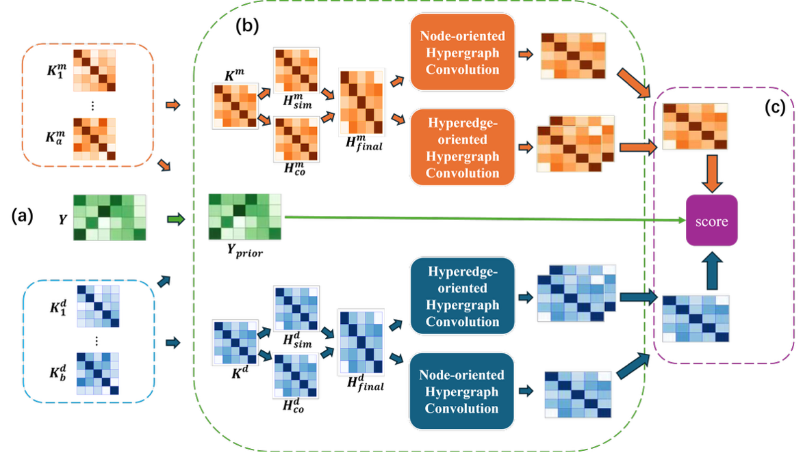

# BiHyperMDA: Bidirectional Hypergraph Learning with Hyperedge Interactions for miRNA-Disease Association Prediction 

Identification of miRNA-disease associations (MDA) is a critical task for understanding disease mechanisms and developing diagnostic biomarkers, while traditional experimental approaches are notoriously costly and time-consuming. Many computational algorithms have emerged as an efficient and scalable alternative for reliably inferring potential MDAs, but the sparsity of known miRNA–disease associations make models relying solely on supervised signals prone to overfitting and limits their generalization ability particularly in predicting associations involving previously unseen miRNAs and diseases, and existing methods typically extract high-order information through the node–hyperedge–node paradigm while ignoring interactions among hyperedges and treating all hyperedges as equally important and independent. To address these issues, we propose a novel end-to-end model called BiHyperMDA, which constructs similarity-based and co-occurrence-based hypergraphs and performs bidirectional hypergraph convolution from both node and hyperedge perspectives to capture high-order information. Furthermore, synergistic regulatory patterns are extracted by combining multiple hyperedges. Finally, the prediction scores are integrated with a bidirectional graph diffusion prior to improve the robustness and accuracy of prediction, while alleviating the cold-start problem. Experimental results demonstrate the effectiveness of distinct modules, and the good performance of our model compared to state-of-the-art models. This work provides a useful approach for computationally identifying potential MDAs. 
 

  

